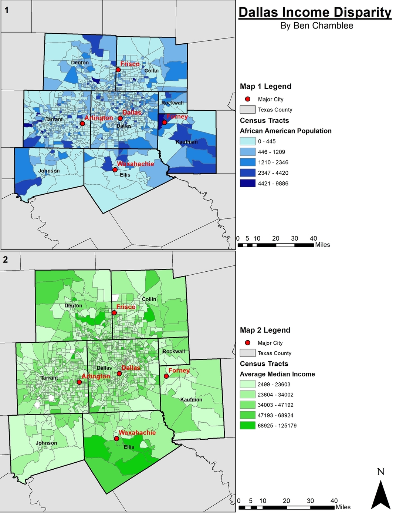
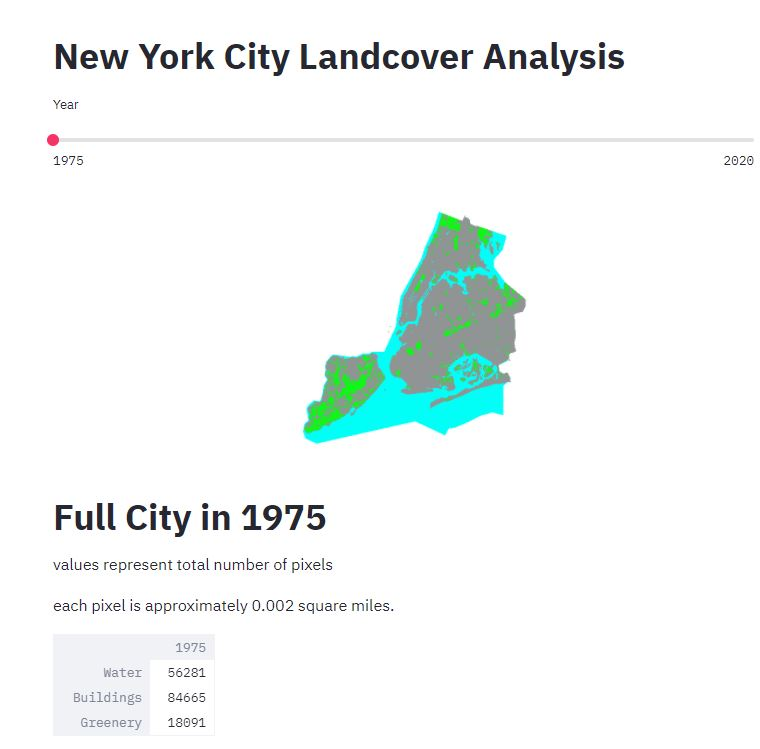

##  ________

### Hello!

### My name is Ben    
This is my cover letter for ESRI, a company where I would absolutlely LOVE to work!
I've been interested in visualizing geographic data for many years now: 
- From my time as a student of Geography at The University of Texas:   
       
- To my current endevors as an aspiring data scientist:     
        
I want to continue to create awesome projects like these to help people around the world! Just like ESRI I want my work to contribute to sustainability, community, education, research, and positive change.

### How can I help ESRI with their mission? with DATA 
I've been using data to answer questions and solve problems for a long time

- What's the best coffeeshop in Austin? [There's a spreadsheet for that](https://docs.google.com/spreadsheets/d/1ej90jWdd38xZb2M440tFu2RBhw0qJF92Jl6uLJeZU5A/edit?usp=sharing)
- Can you really taste the difference between red velvet and chocolate cake? [There's a spreadsheet for that](https://docs.google.com/spreadsheets/d/1-mqfiPSJpwAZFdIneJR1HSIZY6rC7ZfcZa_cJdHnmg0/edit?usp=sharing)

Here's a more useful one:  
- When should all the interns who have different schedules and are located in different parts of the country meet up? [There's a spreadsheet for that](https://docs.google.com/spreadsheets/d/1cYUTfm4D-B3j6mDdcGZA84LX3IJzBRVbM7zbRk5V8Xo/edit?usp=sharing)

### I also have been learning Python over the past few years and am currently completing a full data science bootcamp!
My resume can tell you more about this or you can also check out my [Github](https://github.com/Bench-amblee?tab=repositories) to see what I've been working on.  
I can confidently work on any project that involves
- Python, including libraries like pandas, numpy, matplotlib, streamlit, and seaborn
- HTML/CSS (and markdown files to like the one you're reading now)
- Excel and Google Sheets
- SQL
- Tableau
- Git/Github  
And I can pick up skills that I'm not familiar with like writing in JavaScript or HTML5. I'm learning more about Data Science every day and would love to add these programs to my repetoire.

### I have plenty of experience working with marketing analytics and using data to make decisions
I worked at a digital marketing company in Austin where we supported a lot of independent businesses using analytics.
Whether it was to engage with their clients more on social media or to post more frequently, the rest of the team and I helped a lot of businesses succeed just by interpreting data, answering questions, and solving problems. 
### I'd love to do the same at Patreon
If you've gotten this far, thank you so much for reading through this whole letter!  
I'd love to talk more about Patreon's goals for this position and how I can help achieve them.   
Thank you again, I hope to hear from you soon!  
